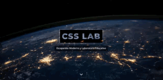
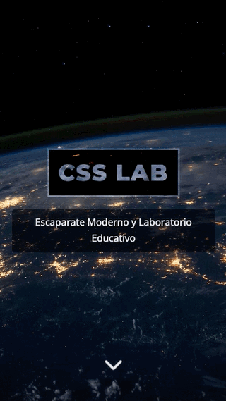
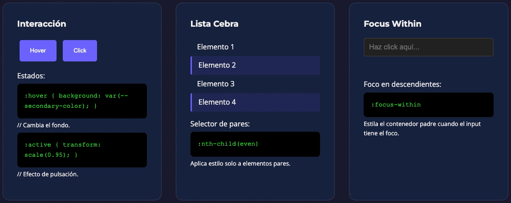
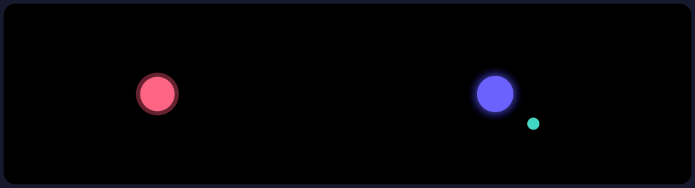
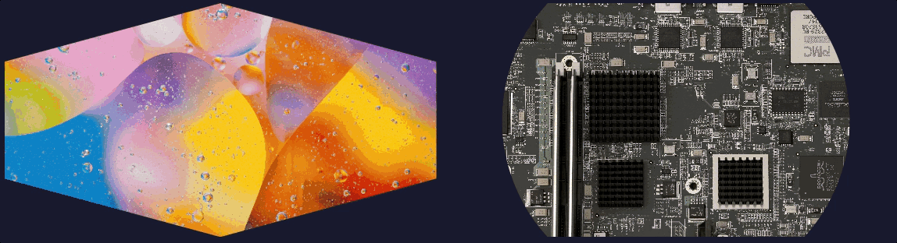

# 🧪 CSS LAB | Escaparate Moderno y Laboratorio Educativo

[](https://github.com/yriaforjan/css-lab)

## ¿Qué es CSS LAB?

CSS LAB es un proyecto de exploración técnica donde pongo a prueba las capacidades de CSS moderno para crear interfaces visualmente impactantes, interactivas y totalmente responsivas sin depender de librerías externas.

## 🌐 Despliegue

El proyecto se encuentra desplegado y puede visualizarse en tiempo real a través del siguiente enlace:
🚀 **[Ver Demo en Vivo](https://css-lab-diw.vercel.app/)**

## 📸 Vista Previa

| 🖥️ Desktop View | 📱 Responsive Design |
| :---: | :---: |
|  |  |

### 🔍 Detalles del Laboratorio
A continuación se muestran los módulos principales en funcionamiento:

* **Interactividad y Pseudoclases:**
    
    *Demostración de estados hover, active y focus-within.*

* **Animaciones y Geometría:**
    
    

    *Sistemas de órbitas con Keyframes y recortes con Clip-path.*

---

## 🎯 Características Principales

* **Efecto Parallax:** Implementación con `background-attachment: fixed` en las secciones Hero y Parallax.
* **Laboratorio de Pseudoclases:** Interactividad con `:hover`, `:active`, `:nth-child`, y el selector de ancestros `:focus-within`.
* **Animaciones CSS:** Uso de `@keyframes` para crear sistemas de órbitas y efectos de pulsación.
* **Efectos Avanzados:** Manipulación de geometría de imágenes mediante `clip-path: polygon()` y `circle()`.

---

## 🛠️ Stack Tecnológico y Diseño

### 🚀 Tecnologías Principales

| Capa | Tecnología | Versión/Fuente | Propósito |
| :--- | :--- | :--- | :--- |
| **Estructura** | HTML5 | Estándar | Marcado semántico del documento. |
| **Estilos** | CSS3 | Estándar | Diseño visual, animaciones y layout. |
| **Tipografía** | Google Fonts | Montserrat & Open Sans | Fuentes web personalizadas de alta legibilidad. |
| **Iconos** | Font Awesome | v6.4.0 (vía CDN) | Biblioteca de iconos vectoriales. |
| **Recursos** | Imágenes | Assets locales | Fondos y demostraciones visuales. |

### 🎨 Sistema de Diseño
Variables CSS personalizadas en `:root` :
* **Colores**: `--primary-color`, `--secondary-color`, `--accent-color`
* **Tipografía**: `--font-heading`, `--font-body`
* **Espaciado**: `--spacing-sm`, `--spacing-md`, `--spacing-lg`

---

## ⚙️ Características Técnicas

* **Arquitectura Minimalista:** 2 archivos principales (`index.html` y `style.css`).
* **Sin JavaScript:** Todas las interacciones son CSS puro.
* **Diseño Responsivo:** Media queries para adaptación móvil.
* **Variables CSS** Sistema de diseño centralizado con custom properties.
* **CDN Optimizado:** Recursos externos desde Google Fonts y Cloudflare.

### 🔗 Dependencias Externas

Para el correcto renderizado de la interfaz y la iconografía, el proyecto utiliza los siguientes enlaces externos integrados en el `<head>`:

```html
<!-- Google Fonts -->  
<link href="https://fonts.googleapis.com/css2?family=Montserrat:wght@700;800&family=Open+Sans:wght@400;600&display=swap" rel="stylesheet" />
```
```html
<!-- Font Awesome -->  
<link rel="stylesheet" href="https://cdnjs.cloudflare.com/ajax/libs/font-awesome/6.4.0/css/all.min.css" />
```

---

## 📱 Compatibilidad del Navegador

El proyecto ha sido testeado para garantizar su funcionamiento en:

| Navegador | Versión Mínima |
| :--- | :--- |
| **Google Chrome** | 60+ |
| **Mozilla Firefox** | 55+ |
| **Safari** | 12+ |
| **Microsoft Edge** | 79+ |

> 🌐 **Nota:** Requiere conexión a internet para cargar recursos desde CDN (Google Fonts y Font Awesome).

---

## 🚀 Instalación y Ejecución Local

Para visualizar el laboratorio correctamente y evitar problemas de carga de recursos locales, se recomienda iniciar un servidor local:

```bash
# 1. Clonar el repositorio
git clone [https://github.com/yriaforjan/css-lab](https://github.com/yriaforjan/css-lab)

# 2. Iniciar servidor local (elige una opción)
python -m http.server 8000  # Python
npx http-server             # Node.js
php -S localhost:8000       # PHP
```

---

## 🗂️ Estructura del Proyecto

```text
css-lab/  
├── index.html          # Estructura HTML principal  
├── style.css           # Hoja de estilos centralizada  
└── assets/             # Recursos estáticos
    ├── favicon.svg     # Icono del sitio
    └── img/            # Galería de imágenes
        ├── nasa.jpg    
        ├── pcs.jpeg    
        ├── bubbles.jpeg
        └── board.jpeg
```

---

## 📄 Licencia

Este proyecto es **de carácter escolar y educativo**, desarrollado como parte de un trabajo de la asignatura *Diseño de Interfaces Web*.
No está destinado a fines comerciales ni de distribución fuera del ámbito educativo.

---

## 👩🏼‍💻 Autor  
  
Desarrollado por **Yria Forján Oliveira**  
GitHub: [@yriaforjan](https://github.com/yriaforjan)